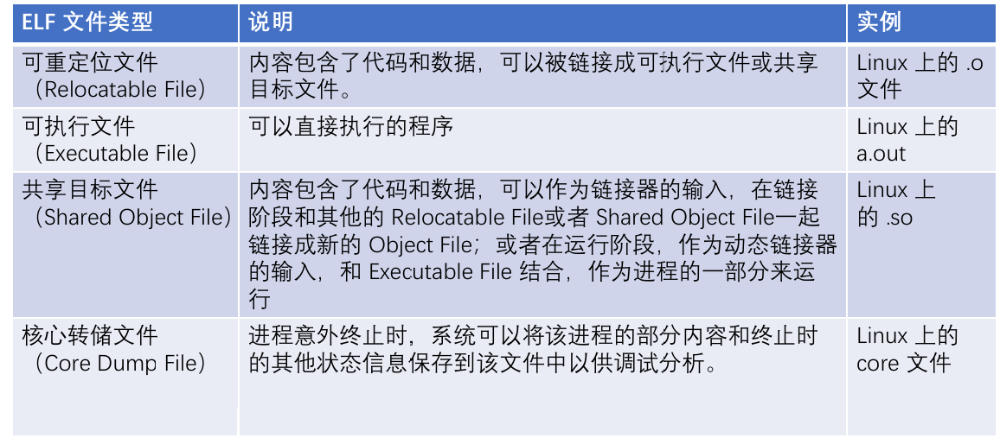
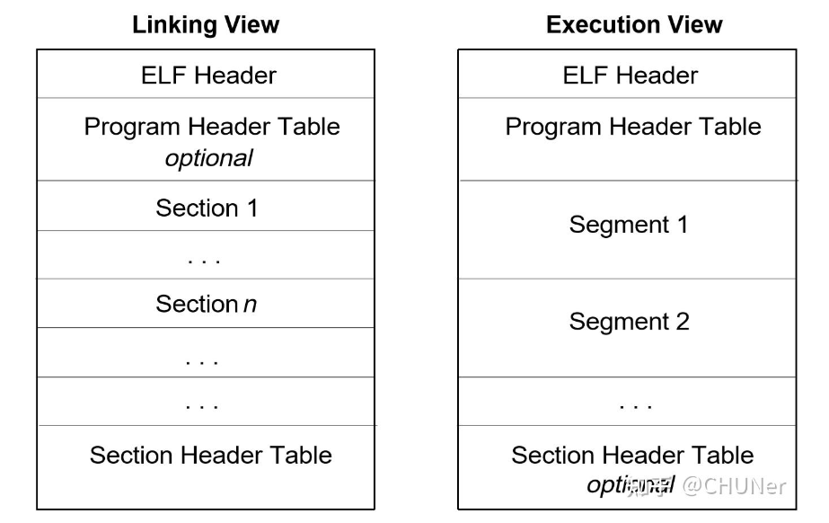

# RVEMU
简易的RISC-V架构模拟器


## 环境搭建

1.创建docker容器,相关脚本放在`/docker`目录下

2.进入容器,安装必要依赖

2.1 换源

```bash
sed -i s@/archive.ubuntu.com/@/mirrors.aliyun.com/@g /etc/apt/sources.list
sed -i s@/security.ubuntu.com/@/mirrors.aliyun.com/@g /etc/apt/sources.list
apt-get clean
apt-get update
```

2.2 安装依赖

```bash
apt-get install -y clang make
```

2.3 安装交叉编译工具链

- 先去git下载编译好的交叉编译工具链

- 解压到本地
```bash
tar -zxvf riscv64-elf-ubuntu-20.04-nightly-2023.04.21-nightly.tar.gz

# 解压后生成的文件夹为riscv,我们需要的交叉编译器为riscv64-unknown-elf-gcc
```
- 配置环境变量
```bash
vim ~/.bashrc
export PATH=$PATH:/riscv/bin
```


## GCC交叉编译工具链

### 命名规则

交叉编译工具链通常按以下格式进行命名：

```bash
[arch-][vendor-][os-][abi-]name
```

- [ ]表示可省略
- arch：指体系结构，例如arm、x86_64、aarch64
- vendor：指工具链提供商，例如apple、unknown或者直接省略
- os：指目标平台运行的操作系统，例如linux，none（裸机开发，不会链接任何与OS相关的库），elf（这个其实并非指操作系统，而是指文件以elf格式保存，可用于裸机和Unix操作系统）
- abi：应用程序二进制接口(Application Binary Interface)，交叉编译链所选择的**C库函数**和**目标映像的规范**，该字段常见的值有abi 、eabi(embedded abi)、gun(glibc+oabi)、gnueabi(glibc+eabi)、gnueabihf (hf 指默认编译参数支持硬件浮点功能)等。

示例

```bash
1. arm-linux-gnueabi-gcc：用于ARM体系结构的交叉编译工具链。"arm"表示ARM体系结构，"linux"表示目标操作系统为Linux，"gnueabi"表示使用GNU的嵌入式ABI。

2. arm-linux-gnueabihf-gcc：与上面的工具链类似，但是添加了"hf"表示使用硬浮点（hard-float）的ABI。这意味着该工具链支持使用硬件浮点指令进行浮点运算。

3. x86_64-linux-gnu-gcc：用于x86-64体系结构（也称为AMD64或Intel 64）的交叉编译工具链。"x86_64"表示目标体系结构为x86-64，"linux"表示目标操作系统为Linux，"gnu"表示使用GNU的ABI。

4.riscv64-unknown-elf-gcc：用于riscv64体系结构，unknown表示开发商未知，elf表示是针对裸机程序进行编译，默认使用eabi
```

### 工具链的组成

工具链通常不只是编译器，还包括binutils（二进制处理工具）和C库比如glibc

```bash
|---aarch64-linux-gnu/			<----特定于 ARM 架构的交叉编译工具链的二进制文件、库和头文件
|---bin/						<----Binutils：一组用于编译、汇编、链接等操作的工具集合
	|---aarch64-linux-gnu-gcc
	|---aarch64-linux-gnu-g++
	|---...
|---include/					<----和 C++ 标准库的头文件，以及 GCC 内部使用的头文件
|---lib/					    <----这三个lib通常包含库文件和辅助程序
|---lib64/
|---libexec/
|---share/                       <----包含一些额外的数据文件，如语言文件、man pages、GCC 的插件和配置脚本等
```


参考链接：

- [GCC交叉编译器的命名与用法 | sfysoft](https://www.sfysoft.com/2019/07/15/Cross-Build-Compiler-Name-Usage/index.html)
- [linux下的交叉编译 - circlelll - 博客园](https://www.cnblogs.com/circlelll/p/18087254)


## ELF文件格式解析

ELF（Executable and Linkable Format）是一种可执行文件和可链接库的**标准格式**，通常在Linux和其他类Unix操作系统中使用。ELF文件包含了程序的代码、数据、符号表、调试信息等。

> - 如果用了Linux，则可执行文件或库必须用ELF格式保存
> - ELF不是任何特定架构的必需格式，裸机程序就可以不用ELF
> - 如果要使用ELF文件，则需要实现个**加载器**来对ELF文件进行解析，Linux操作系统本身通常充当加载器，如果裸机程序要用ELF格式的，则必须手动实现个加载器，比如QEMU其实就内置了个加载器，所以才支持ELF格式的裸机程序

采用ELF格式的文件主要有以下4类：



ELF 文件的作用有两个，一是用于**程序链接**（为了生成程序）；二是用于**程序执行**（为了运行程序）。针对这两种情况，可以从不同的视角来看待同一个目标文件。当它分别被用于链接和用于执行的时候，其特性必然是不一样的，我们所关注的内容也不一样。从链接和运行的角度，可以将 ELF 文件的组成部分划分为**链接视图**和**运行视图**这两种格式。



- ELF Header：位于文件开始处，包含整个ELF文件的信息
- Program Header Table：用于程序的**执行**，告诉系统如何创建进程的镜像
- Section：用于程序的**链接**，在每个节中包含有指令数据、符号数据、重定位数据等等，例如.text、.data、.bass节...
- Segment：在内存中加载的区域，包含多个Section
- Section Header Table：包含所有Section的信息

对于可执行程序，`Program Header`是必须的，描述了不同的段即`Segment`,`Section Header`是可选的

对于链接程序，`Program Header`是可选的，`Section Header`是必须的，描述了不同的`section`

### 分析ELF格式文件的工具

- `file`：快速查看 ELF 文件类型

- `readelf`：查看 ELF 文件的头信息、节头、程序头等详细信息

  - `-h`：查看ELF Header

  ```bash
  ELF Header:
    Magic:   7f 45 4c 46 01 01 01 00 00 00 00 00 00 00 00 00 
    Class:                             ELF64
    Data:                              2's complement, little endian
    Version:                           1 (current)
    OS/ABI:                            UNIX - System V
    ABI Version:                       0
    Type:                              EXEC (Executable file)
    Machine:                           RISC-V
    Version:                           0x1
    Entry point address:               0x100000000
    Start of program headers:          64 (bytes into file)
    Start of section headers:          9720 (bytes into file)
    Flags:                             0x0
    Size of this header:               64 (bytes)
    Size of program headers:           56 (bytes)
    Number of program headers:         1
    Size of section headers:           64 (bytes)
    Number of section headers:         27
    Section header string table index: 25
  ```

  - `-l`：查看Program Header Table

  ```bash
  Program Headers:
    Type           Offset   VirtAddr   PhysAddr   FileSiz MemSiz  Flg Align
    LOAD           0x000000 0x00000000 0x00000000 0x004000 0x004000 R E 0x1000
    LOAD           0x004000 0x00004000 0x00004000 0x000000 0x000000 RW  0x1000
  ```

  - `-S`：查看Section Header Table

  ```bash
  Section Headers:
    [Nr] Name     Type             Address           Off    Size   ES Flg Lk Inf Al
    [ 0] .text    PROGBITS         0000000000001000  000004  0003c0 00  AX  0   0  16
    [ 1] .data    PROGBITS         0000000000004000  0003c4  000100 00  WA  0   0  16
    [ 2] .bss     NOBITS           0000000000005000  0004c4  000100 00  WA  0   0  16
    [ 3] .symtab  SYMTAB           0000000000006000  0005c4  000f00 10  0   10  4
  ```

  - `-a`：显示所有信息
  - `-D`：显示 ELF 文件的动态符号表，通常用于动态链接的 ELF 文件

  ```bash
  Dynamic section at offset 0x6b0 contains 20 entries:
    Tag        Type                         Name/Value
    0x0000000000000001 (NEEDED)             Shared library: [libc.so.6]
    0x000000000000000c (INIT)               0x0000000000010000
    0x000000000000000d (FINI)               0x0000000000011000
    0x0000000000000019 (SONAME)             Library soname: [libfoo.so.1]
  ```

  - `-s` ：显示 ELF 文件的符号表，列出文件中的所有符号，包括函数、变量、对象等

  ```bash
  Symbol table '.symtab' contains 5 entries:
     Num:    Value          Size Type    Bind   Vis      Ndx Name
     1:  0000000000001000     56 FUNC    GLOBAL DEFAULT   1 _start
     2:  0000000000001040     56 FUNC    GLOBAL DEFAULT   2 main
     3:  0000000000001080     56 FUNC    GLOBAL DEFAULT   3 foo
     4:  00000000000010c0     56 FUNC    GLOBAL DEFAULT   4 bar
     5:  0000000000001100     56 FUNC    GLOBAL DEFAULT   5 baz
  ```

- `objdump`：反汇编 ELF 文件，查看汇编代码

- `objcopy`：用于在不同的对象文件格式之间进行转换

  - 将ELF格式的文件转为二进制


```bash
objcopy -O binary -S your_elf_file.elf your_binary_file.bin
```


### ELF和普通二进制文件的区别

1.结构和组织：

- ELF文件：包含多个段，如`.text`、`.data`、`.bss`等，以及程序头表等，用于描述这些段**在内存中的布局**。ELF文件还包含符号表、重定位信息等，用于链接和调试
- 普通二进制文件：通常是简单的连续二进制流，不包含段的概念。它们通常只包含可执行代码和数据，没有额外的元数据，数据之间也没有分段

2.加载和执行：

- ELF文件：需要操作系统的配合来**加载**和执行。操作系统会解析ELF文件的程序头表，将各个段加载到内存中的适当位置，并执行文件头指定的入口点。举个例子：假设有一个简单的 ELF 文件，其中 `e_entry` 指向地址 `0x1000`，表示程序的入口点。
  - 操作系统加载 ELF 文件时，会根据程序头表将 `.text` 段（代码段）加载到内存中，例如加载到 `0x1000` 地址。
  - 加载完成后，操作系统将 CPU 的程序计数器（PC）设置为 `0x1000`，开始执行位于该地址的指令。

- 普通二进制文件：直接被烧录到内存中，不需要操作系统的参与。芯片复位时PC指针会被设定为固定地址，并从该地址开始执行，所以普通二进制文件一般直接被加载到该地址（像之前写的STM32裸机程序、U-Boot之类的都是这样开始运行的）

3.重定位和链接：

- ELF文件：支持动态重定位和链接，可以在运行时动态加载和链接共享库（==只有ELF格式的文件才支持动态库==）
- 普通二进制文件：不支持动态重定位和链接，它们通常是静态编译的，所有必要的代码和数据都包含在单个文件中

4.文件大小和效率：

- ELF文件：由于包含额外的元数据，文件大小可能比普通二进制文件大
- 普通二进制文件：通常更小，因为它们只包含必要的代码和数据

## 项目参考链接

- [ksco/rvemu: A simple and fast RISC-V JIT emulator.](https://github.com/ksco/rvemu)
- [yanglianoo/rvemu: 基于risc-v架构的模拟器](https://github.com/yanglianoo/rvemu)